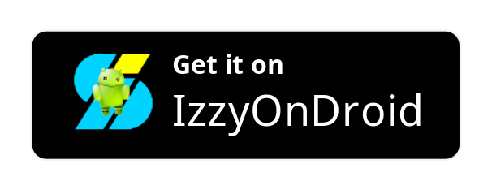

# Neo Feed 

**Custom Google Discover Feed replacement for launchers.**

## Installation

## Community

- Our main channel on Telegram: [Neo Applications channel](https://t.me/neo_applications).
- Otherwise can join either our [Telegram](https://t.me/neo_launcher) or [Matrix](https://matrix.to/#/#neo-launcher:matrix.org) groups to test builds, make suggestions, ask questions or just chat.

## Supported launchers

Any launcher with custom feed provider support. For example:
- Neo Launcher
- LibreChair
- Shade Launcher

## Translation 

Translations are hoasted at Weblate. If want to help,
visit <a href="https://hosted.weblate.org/projects/neo-feed/">our project on Weblate</a>.

## Credits

[iTaysonLab](https://github.com/iTaysonLab) as the project is a fork of his HomeFeeder.

[DrawerOverlayService](https://github.com/FabianTerhorst/DrawerOverlayService) as base for overlay
service.

[Helena Zheng](https://helenazhang.com/) & [Tobias Fried](https://tobiasfried.com/) for the great [Phosphor Icons](https://phosphoricons.com/), we gladly use.

## Authors

Saul Henriquez & Antonios Hazim
