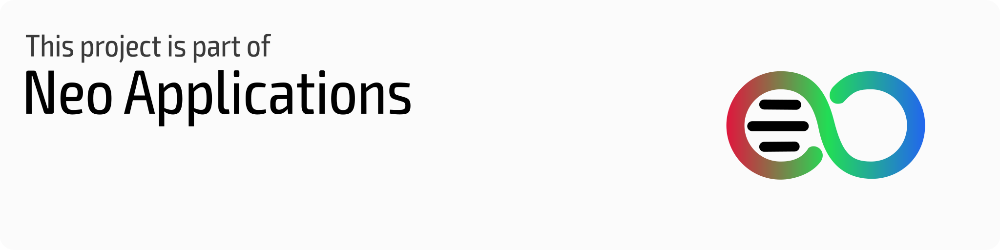
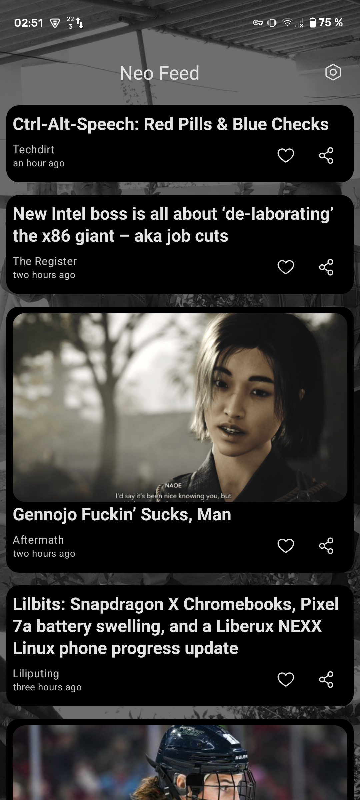
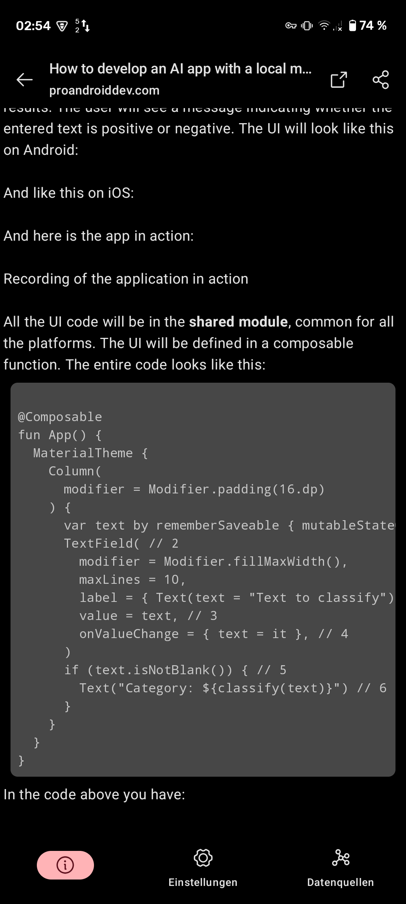
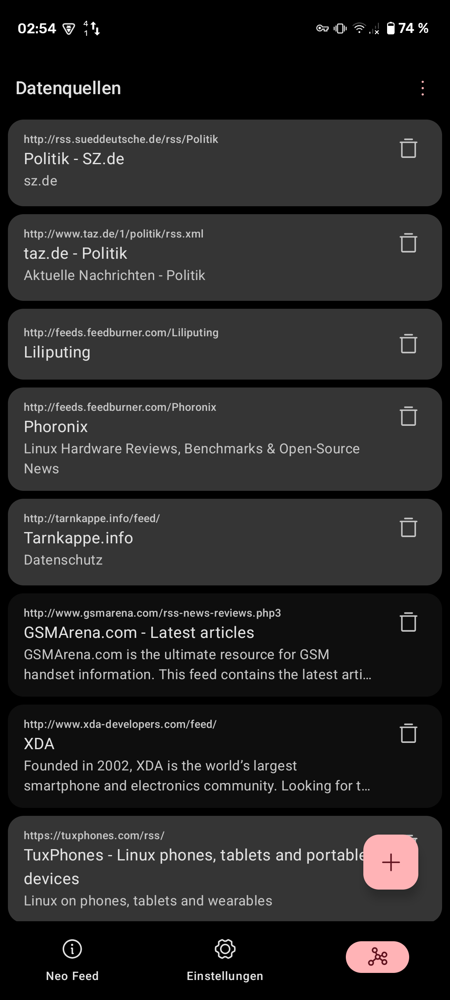
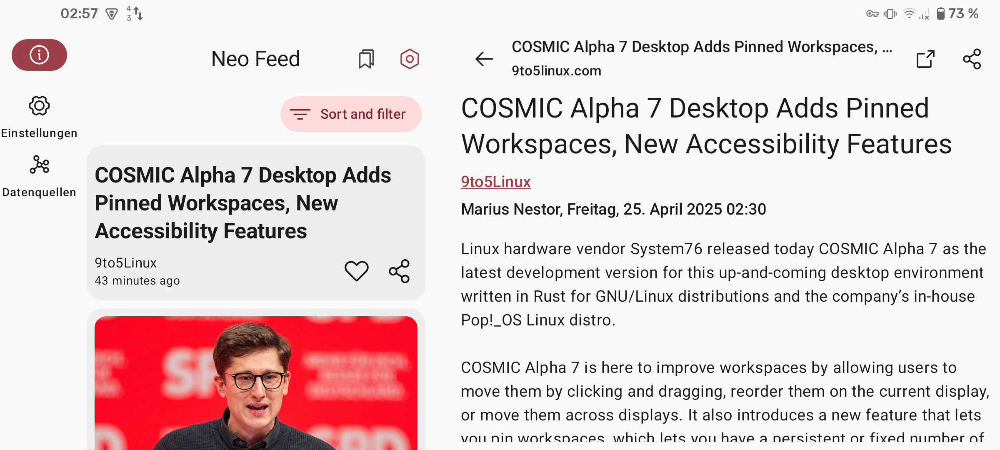

<h1 align="center">
  
   
  Neo Feed
  
</h1>

<strong>Custom Google Discover Feed replacement for launchers!</strong>

## Screenshots :framed_picture:

### Neo Launcher integration, local reader and feeds customization

|  |  |  |
|:---------------------------------------------------------------------------------------------------------------------:|:---------------------------------------------------------------------------------------------------------------------:|:---------------------------------------------------------------------------------------------------------------------:|

### Supports wide screens like tablets and TVs

|  |
|:----------------------------------------------------------------------------------------------------------------------:|

### Supported launchers

Any launcher with custom feed provider support. For example:

- Neo Launcher
- LibreChair
- Shade Launcher

## Community :speech_balloon:

You can join either our [Telegram](https://t.me/neo_launcher) or [Matrix](https://matrix.to/#/#neo-launcher:matrix.org) groups to make suggestions, ask questions, receive news, install test builds, or just chat.

## Translation :left_speech_bubble: 

Contribute your translations to Neo Feed on [Hosted Weblate](https://hosted.weblate.org/engage/neo-feed/).   Adding new languages is always accepted and supported.

## Special Thanks :heart:

[iTaysonLab](https://github.com/iTaysonLab) as the project is a fork of his HomeFeeder.

[DrawerOverlayService](https://github.com/FabianTerhorst/DrawerOverlayService) as base for overlay service.

[Helena Zheng](https://helenazhang.com/) & [Tobias Fried](https://tobiasfried.com/) for the great [Phosphor Icons](https://phosphoricons.com/), we gladly use.

### Contributors :handshake:

## Copylefted Libre License :scroll:

Licensed under the [GPLv3+](/LICENSE).

Copyright © 2025 [Saul Henriquez](https://github.com/machiav3lli) & [Antonios Hazim](https://github.com/machiav3lli)

